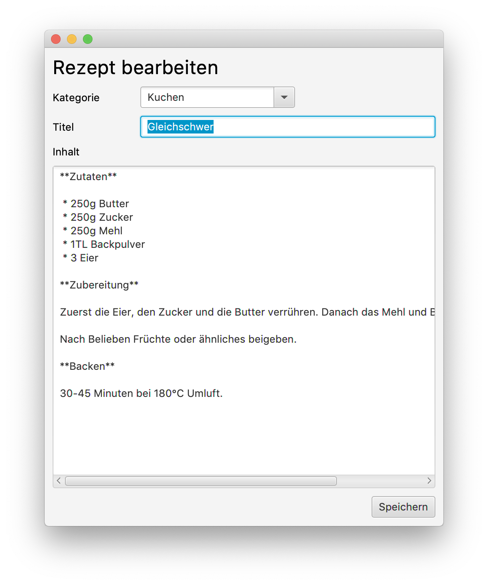
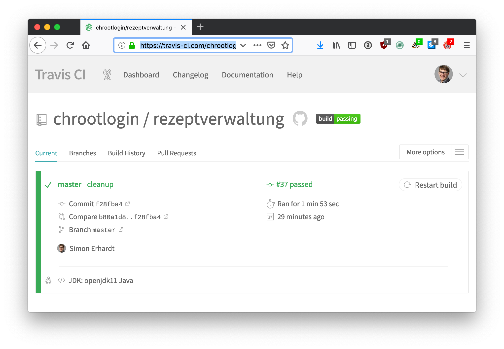

# Rezeptverwaltung

Die "Rezeptverwaltung" ist ein einfaches Tool zum Verwalten von Rezepten. Sie gibt dem Benutzer die Möglichkeit eigene Rezepte in Kategorien zu sortieren, einzutragen und zu löschen. Zur einfacheren Formatierung kann der Benutzer Markdown-Syntax zum Erfassen der Rezepte verwenden.



Das Projekt entsteht im Zusammenhang mit dem Studium an der [HFTM](http://www.hftm.ch).

## Benutzerdokumentation

**Features**

 * Erstellen, Löschen von Rezeptkategorien
 * Erstellen, Bearbeiten und Löschen von Rezepten
 * Rendering von Rezepten in Markdown

**Systemvorraussetzungen**

 * Windows, Mac OS X oder Linux
 * Java 11 JRE
 * 1 GB RAM

**Download**

Das Programm kann über bintray.com heruntergeladen werden: [https://bintray.com/rootlogin/generic/rezeptverwaltung](https://bintray.com/rootlogin/generic/rezeptverwaltung)

Für das Windows Betriebssystem steht eine Exe-Datei zur Verfügung. Auf anderen Systemen kann die Jar-Datei verwendet werden.

### Bedienungsanleitung

#### Rezept anlegen
Hauptmenu -> Rezept -> Erstellen

#### Rezept bearbeiten/löschen
Rechtklick auf Rezeptlink -> Bearbeiten bzw. Löschen

#### Kategorie anlegen/löschen
**Achtung!** Beim Löschen einer Kategorie gehen alle Rezepte dieser Kategorie verloren.

Hauptmenu -> Kategorie -> Erstellen bzw. Löschen

## Entwicklerdokumentation

Der Quellcode der Applikation liegt auf [github.com](https://github.com/chrootlogin/rezeptverwaltung). Der Quellcode wird dort mittels GIT verwaltet und versioniert.

**Vorraussetzungen**

 * Maven 3.5
 * Java 11 JDK

Wenn alle Anforderungen erfüllt sind, kann das Projekt einfach mit Maven gebaut werden.

### Verwendete Bibliotheken

 * **Spring Boot 2.1.2:** Framework, welches Dependency Injection und Ähnliches bereitstellt.
 * **Hibernate:** Object Relational Mapper zum Vereinfachten Datenbankzugriff.
 * **H2 Database:** Relationale Embedded Datenbank für Java.
 * **OpenJFX 10.0.2:** Freie JavaFX Implementierung. Wird für das UI verwendet.
 * **Flexmark 0.40.16:** Markdown zu HTML Renderer. Wird für die Rezepte verwendet.
 * **JTwig 5.87:** Twig Template-Engine in Java zum Rendern der Rezepte.
 * **Apache Commons 2.6:** Sammlung von Java-Helpern
 * **Launch4J:** Erstellen der EXE-Datei unter Windows.

### Builden der Applikation

Zum Builden der Applikation wird Maven verwendet. Das Projekt liefert einen Maven-Wrapper mit.

```
$ mvn clean package
```

### Continous Integration



Der Quellcode wird automatisch mit [Travis-CI](https://travis-ci.com/chrootlogin/rezeptverwaltung) gebaut und auf Bintray hochgeladen. Somit stehen jederzeit aktuelle Päckchen zur Verfügung.

### Lizenz

Der Quellcode steht unter der GNU General Public License 3.0 bereit.

## Projektdokumentation

### Umsetzung der Projektziele

Hier wird die Umsetzung Projektziele gemäss Aufgabenbeschrieb genauer beschrieben.

#### JavaFX

Die Applikation ist mit OpenJFX dem Nachfolger von JavaFX erstellt worden.

#### Zwei unterschiedliche Typen von Objekten

Dies ist mit den Entitäten Rezept und Kategorie umgesetzt.

#### Datenpersistenz

Die Benutzerdaten werden mit Hibernate in eine H2 Datenbank gespeichert. Alle Informationen zur Datenbank befinden sich in der `src/main/resources/application.properties` Datei. Beim ersten Start wird die Datenbank automatisch mit Beispielen befüllt. Die Entities der Datenbank werden Model-Klassen bereitgehalten und mit Annotations konfiguriert.

#### Interfaces/Vererbung

Interfaces und Vererbung werden an mehreren Orten eingesetzt. Beispielsweise sind die Entity-Repositories nur als Interfaces vorhanden, da die notwendige Klasse automatisch von Hibernate abgeleitet wird.

#### Collections und Sortierung

Collections werden oft eingesetzt, insbesondere die ComboBoxen zur Auswahl der Kategorie stellen Collections dar. Auch wird mit den Kategorien als Collections gearbeitet. Zusätzlich werden die Kategorien und Rezepte mit der Sort-Funktionalität alphabetisch geordnet.

#### ENUMs

Der Datentyp eines Rezepts (Text oder Markdown) wird als ENUM gespeichert. Aktuell ist diese Funktion allerdings nicht in Benutzung. Der Typ eines Rezepts wird zwar gespeichert, ist aber immer Markdown.